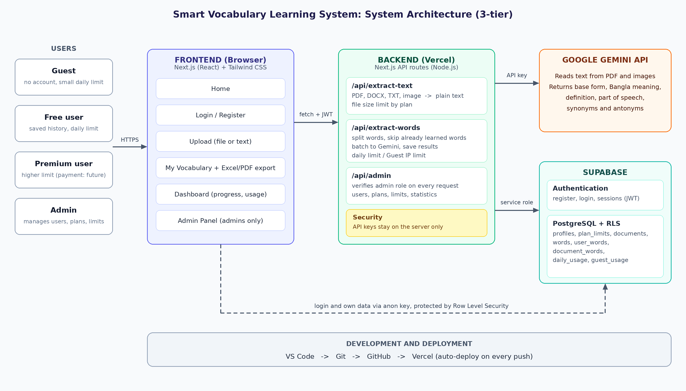
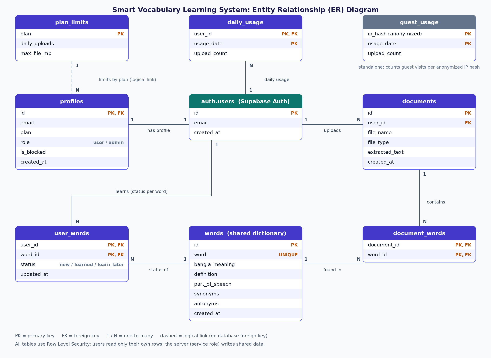

# Smart Vocabulary Learning System

An AI-powered web application that turns any English document into a personal vocabulary lesson. Upload a PDF, Word, TXT or image file (or paste text) and the system extracts the English words, explains each one with its **Bangla meaning, English definition, part of speech, synonyms and antonyms**, and remembers which words you already know, so the same word is never taught twice.

**Live demo:** https://smart-vocabulary-tau.vercel.app

## Features

|User type|What they can do|
|-|-|
|**Guest**|Paste text or upload a `.txt` file and get vocabulary without an account (small daily limit per IP, history is not saved)|
|**Free user**|Everything above, plus PDF, DOCX and image upload, saved learning history, personalized filtering, My Vocabulary, Dashboard, Excel/PDF export (daily limit)|
|**Premium user**|Higher limits (payment integration is planned)|
|**Admin**|Admin panel: statistics, user list and search, plan change, block/unblock, plan limits, view and delete user data|

Main capabilities:

* Text extraction from PDF, DOCX, TXT and images
* AI vocabulary analysis with Google Gemini (base form, spelling correction, Bangla meaning, definition, synonyms, antonyms)
* **Personalized filtering:** words you marked as known (or already saw) are excluded from future uploads
* "I Know This Word" and "Learn Later" actions
* My Vocabulary with All / New / Learn Later / Learned views and search
* Dashboard with total, learned and remaining words, progress and daily usage
* Export of any list to Excel or PDF
* Word pronunciation (browser text-to-speech)
* Role-based admin panel

## How it works

```
Document Upload -> Text Extraction -> Gemini AI -> Important Vocabulary -> Database Save
-> User Display -> Learn/Know Action -> Learning History Save -> Future Upload Filters Learned Words
```

Words are split by the server, already-known words are removed, words that exist in the shared dictionary are reused, and only the remaining words are sent to Gemini in batches. This keeps AI cost and response time low.

## Architecture



* **Frontend:** Next.js (React) with Tailwind CSS
* **Backend:** Next.js API routes on Vercel. The Gemini API key and the Supabase service-role key exist only on the server.
* **Database and authentication:** Supabase (PostgreSQL, Auth, Row Level Security)

## Database



|Table|Purpose|
|-|-|
|`profiles`|Account data: email, plan (`free`/`premium`), role (`user`/`admin`), blocked status|
|`plan\\\\\\\_limits`|Daily upload limit and maximum file size per plan|
|`documents`|Upload history and extracted text|
|`words`|Shared dictionary of analysed words|
|`user\\\\\\\_words`|Learning history: status of each word for each user|
|`document\\\\\\\_words`|Which words came from which document|
|`daily\\\\\\\_usage`|Daily usage of registered users|
|`guest\\\\\\\_usage`|Daily usage of guests, stored under an anonymized IP hash|

The full schema, including triggers and Row Level Security policies, is in [`supabase/schema.sql`](supabase/schema.sql).

## Tech stack

|Layer|Technology|
|-|-|
|Frontend|Next.js, React, Tailwind CSS|
|Backend|Node.js (Next.js API routes)|
|Database / Auth|Supabase (PostgreSQL, Authentication, RLS)|
|AI|Google Gemini API (`@google/genai`)|
|File processing|`mammoth` (DOCX), Gemini multimodal input (PDF, images), `xlsx` (Excel export)|
|Hosting|Vercel|
|Version control|Git and GitHub|

## Project structure

```
smart-vocabulary/
├── docs/                      architecture and ER diagrams
├── supabase/schema.sql        database schema and security policies
└── src/
    ├── app/
    │   ├── page.js            home page
    │   ├── login/             register and login
    │   ├── upload/            upload and vocabulary extraction
    │   ├── my-vocabulary/     saved words, filters, export
    │   ├── dashboard/         progress and usage
    │   ├── admin/             admin panel
    │   └── api/
    │       ├── extract-text/  PDF / DOCX / image -> text
    │       ├── extract-words/ vocabulary extraction, filtering, saving, limits
    │       └── admin/         admin actions (role verified on every request)
    ├── components/            Navbar, WordCard
    └── lib/                   Supabase client, auth hook, word status helpers, export helpers
```

## Getting started

### Prerequisites

* Node.js (LTS)
* A [Supabase](https://supabase.com) project
* A [Gemini API key](https://aistudio.google.com/apikey)

### Setup

```bash
git clone https://github.com/mdabujar7500/smart-vocabulary.git
cd smart-vocabulary
npm install
```

1. In Supabase, open **SQL Editor**, paste the contents of `supabase/schema.sql` and run it.
2. Create a file named `.env.local` in the project root:

```
NEXT\\\\\\\_PUBLIC\\\\\\\_SUPABASE\\\\\\\_URL=your\\\\\\\_supabase\\\\\\\_project\\\\\\\_url
NEXT\\\\\\\_PUBLIC\\\\\\\_SUPABASE\\\\\\\_ANON\\\\\\\_KEY=your\\\\\\\_supabase\\\\\\\_anon\\\\\\\_key
SUPABASE\\\\\\\_SERVICE\\\\\\\_ROLE\\\\\\\_KEY=your\\\\\\\_supabase\\\\\\\_service\\\\\\\_role\\\\\\\_key
GEMINI\\\\\\\_API\\\\\\\_KEY=your\\\\\\\_gemini\\\\\\\_api\\\\\\\_key
GEMINI\\\\\\\_MODEL=gemini-3.5-flash
```

3. Start the development server:

```bash
npm run dev
```

Open http://localhost:3000.

### Create the first admin

Register a normal account on the website, then run this once in the Supabase SQL Editor:

```sql
update public.profiles set role = 'admin' where email = 'your-email@example.com';
```

Log out and log in again; an **Admin** link appears in the navigation bar.

## Deployment

1. Push the code to GitHub.
2. Import the repository in Vercel and add the five environment variables above.
3. In Supabase, open **Authentication, URL Configuration** and set the Site URL and Redirect URLs to your Vercel address.

Every `git push` to `main` deploys automatically.

## Security

* Passwords and sessions are handled by Supabase Authentication.
* **Row Level Security** is enabled on every table; users can read and change only their own data.
* Plan and role cannot be changed from the browser. Admin actions go through a server route that checks the admin role on every request.
* The Gemini key and the service-role key are never sent to the browser.
* Guest usage is limited per IP; only a hash of the IP address is stored.
* Uploaded file type and size are validated on the server.
* Never commit `.env.local` (it is listed in `.gitignore`).

## Limitations and future work

* Online payment for Premium subscription is not implemented yet (admins change plans manually).
* Email confirmation with a custom mail service (SMTP) is planned.
* Word meanings come from an AI model and may occasionally need correction.
* The maximum upload size is 4 MB because of the hosting platform's request limit.
* Planned ideas: flashcards and quizzes, spaced repetition, difficulty levels.

## Author

Project developed as a Computer Science and Engineering project.

* Student: \[Md. Abujar], ID: \[0872220005101047]
* Supervisor: \[Md Shakhawat Hosen ], \[Lecturer]
* Institution: \[Rabindra Maitree University, Kushtia]

